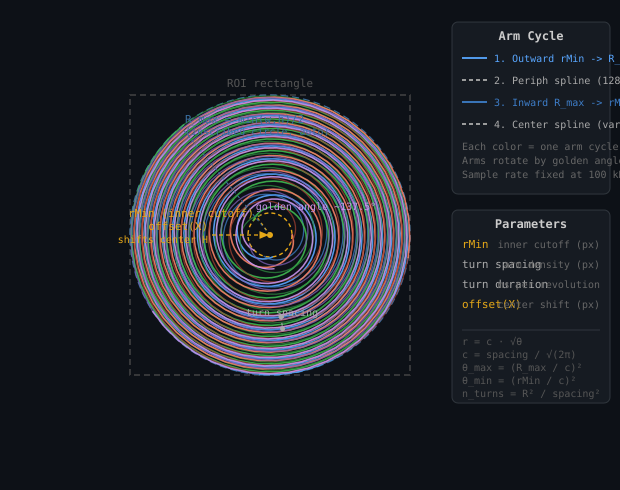

# Fermat Spiral Scanning

## Overview

When **Fermat Spiral Scan** is enabled, the galvo scanner traces a Fermat spiral pattern instead of the normal raster grid. The spiral is defined by:

```
r = c · √θ
```

Because radius grows as the square root of angle, each successive turn covers equal **area**, giving approximately **uniform photon dosage** across the field. Consecutive arms are rotated by the **golden angle** (~137.5°) to maximize angular separation and avoid stripe artifacts.

> This is a proof-of-concept on the `fermat-spiral` branch. No pixel clock is generated; the scanner runs at a fixed 100 kHz sample rate. Empty images are produced if a detector channel is enabled.

---

## Diagram



---

## Arm Cycle State Machine

Each "arm cycle" runs through four phases (`src/Waveform.c` — `GenerateSpiralChunk`):

```
┌──────────────┐   periph    ┌──────────────────┐
│ 1. OUTWARD   │─── conn ───▶│ 2. PERIPH_CONN   │  128-sample spline
│  rMin → Rmax │             │   outer-edge join │
└──────────────┘             └────────┬──────────┘
       ▲                              │
       │                              ▼
┌──────┴───────┐   center    ┌──────────────────┐
│4. CENTER_CONN│◀── conn ────│  3. INWARD       │
│  spline back │             │  Rmax → rMin     │
│  to next arm │             │  (golden-angle   │
└──────────────┘             │   rotated)       │
                             └──────────────────┘
```

| Phase | What happens |
|---|---|
| **Outward** | `r = c·√θ`, angle = `θ + armIndex × goldenAngle`, traces rMin → R_max |
| **Periph conn** | 128-sample cubic spline bridges outer tip to the inward arm start |
| **Inward** | Same formula reversed; angle uses `psi = 2·θ_max + armIndex·goldenAngle` |
| **Center conn** | Variable-length spline, computed to land exactly at next arm's outward start angle |

---

## Parameters

### Spiral Min Radius — `spiralMinRadius`
**Units:** pixels &nbsp;|&nbsp; **Default:** `2.0` &nbsp;|&nbsp; **Range:** `0.5–10`

Controls the **inner cutoff** of each arm. Near θ = 0, the Fermat spiral converges to a point, which would require near-zero galvo velocity — mechanically problematic and prone to velocity inversion. By starting each arm at `rMin` instead of zero:

- Galvo velocity stays bounded and smooth.
- Velocity inversion at the center is avoided (commit `8027afb`).

A short **center-connection spline** bridges the gap between consecutive inward/outward arms across this central hole.

```
θ_min = (rMin / c)²      →  arm starts at r = rMin
```

| Direction | Effect |
|---|---|
| Larger rMin | Bigger blank circle at center, smoother motion |
| Smaller rMin | Denser center coverage, higher galvo stress |

---

### Turn Duration — `spiralTurnDurationMs`
**Units:** ms/revolution &nbsp;|&nbsp; **Default:** `5.0` &nbsp;|&nbsp; **Range:** `0.5–1000`

Controls **how fast** the galvo traces each arm. At the fixed 100 kHz DAQ sample rate:

```
samplesPerTurn = turnDurationMs × 10⁻³ × 100,000 Hz
samplesPerArm  = numTurns × samplesPerTurn
dtheta         = (θ_max − θ_min) / samplesPerArm
```

| Direction | Effect |
|---|---|
| Larger (slower) | More samples/revolution, smoother motion, longer total scan |
| Smaller (faster) | Fewer samples, higher galvo acceleration demand |

---

### Turn Spacing — `spiralTurnSpacing`
**Units:** pixels (at current zoom/resolution) &nbsp;|&nbsp; **Default:** `10` &nbsp;|&nbsp; **Range:** `1–200`

Sets the **radial distance between adjacent arms**. It directly sets the Fermat spiral scale factor `c`:

```
c = turnSpacing / √(2π)
r = c · √θ
```

After one full turn (Δθ = 2π), `Δr ≈ turnSpacing`. The number of turns across the full scan area is:

```
n_turns ≈ R_max² / turnSpacing²
```

The pixel value is converted to volts before use:

```
turnSpacing_volts = turnSpacing_pixels / (zoom × resolution)
```

| Direction | Effect |
|---|---|
| Smaller spacing | Tighter spiral, denser sampling, longer scan |
| Larger spacing | Sparser arms, faster scan, potential coverage gaps |

---

### Offset(X) — `spiralXCenterOffset`
**Units:** pixels &nbsp;|&nbsp; **Default:** `0.0` &nbsp;|&nbsp; **Range:** `−50–50`

Shifts the **center of the spiral** horizontally within the ROI. Without offset the spiral is centered at the ROI center. This compensates for a known offset between the galvo optical axis and the expected center:

```c
// src/DAQConfig.c — SetSpiralWaveformParamsFromDevice
params->centerX = (-0.5*resolution + xOffset + width/2.0
                   + spiralXCenterOffset) / (zoom * resolution);
params->centerY = (-0.5*resolution + yOffset + height/2.0)
                   / (zoom * resolution);
```

| Direction | Effect |
|---|---|
| Positive | Spiral center shifts right |
| Negative | Spiral center shifts left |

> There is currently no Y-axis equivalent.

---

## Outer Radius (auto)

The outer radius is **not a user parameter** — it is derived from the ROI:

```
R_max = min(ROI_width, ROI_height) / (2 × zoom × resolution)
```

This inscribes the spiral circle in the ROI rectangle.

---

## Key Formulas

| Symbol | Formula | Meaning |
|---|---|---|
| `c` | `turnSpacing / √(2π)` | Fermat scale factor |
| `r` | `c · √θ` | Radius at angle θ |
| `θ_max` | `(R_max / c)²` | Outer angular limit |
| `θ_min` | `(rMin / c)²` | Inner angular limit |
| `goldenAngle` | `π(3 − √5) ≈ 2.3999…` | Arm-to-arm rotation |
| `n_turns` | `(θ_max − θ_min) / 2π` | Total turns per arm |
